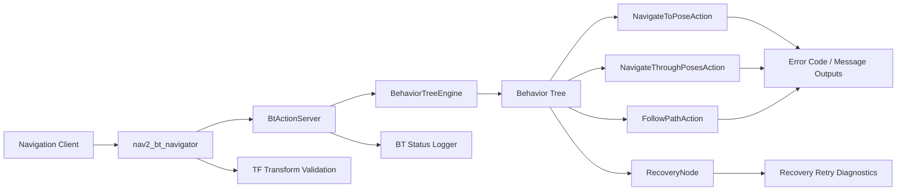
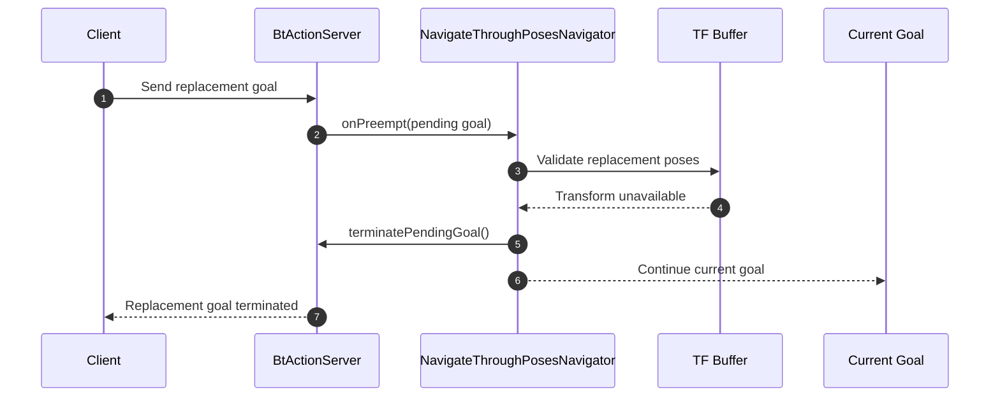
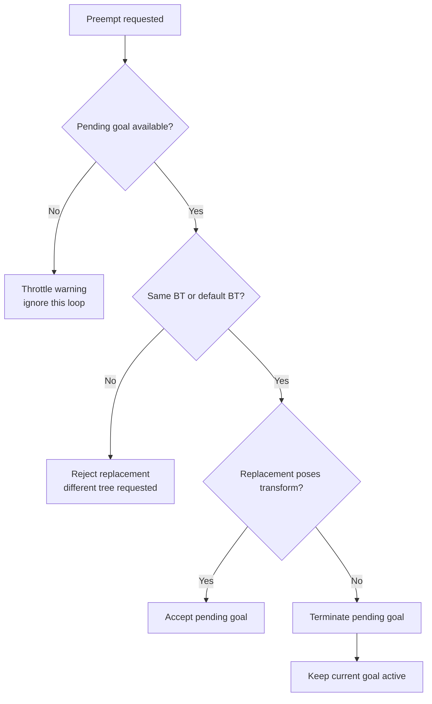
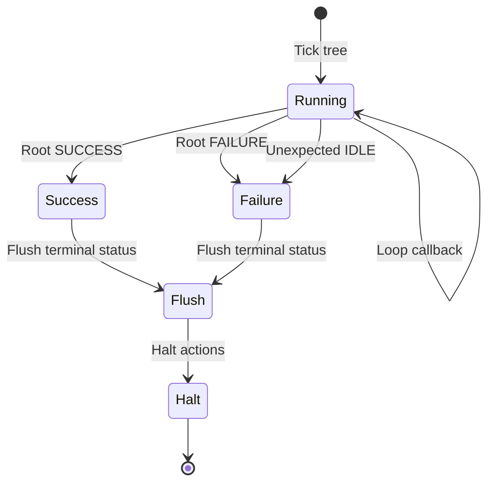
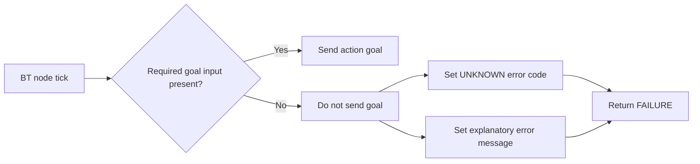
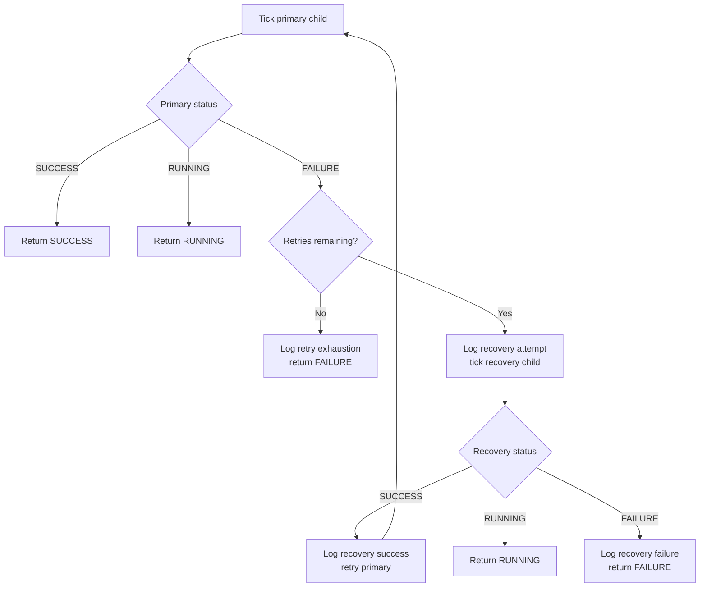
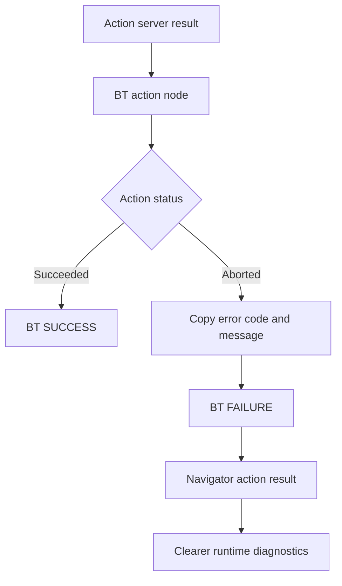
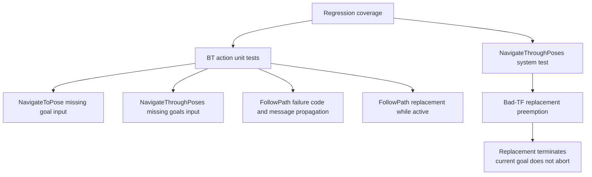

# Nav2 Behavior Tree Navigation Robustness

This fork highlights a focused improvement to Nav2 Behavior Tree navigation failure handling. The work hardens active-goal preemption, improves terminal Behavior Tree diagnostics, propagates clearer action failure information, and adds regression coverage for the affected paths.

## Highlights

- Protects an active `NavigateThroughPoses` goal when a replacement goal cannot be transformed.
- Rejects invalid replacement goals without aborting the current valid navigation request.
- Flushes final Behavior Tree status transitions for complete introspection logs.
- Fails fast when navigation BT action nodes are missing required goal inputs.
- Propagates action error codes and messages through BT blackboard outputs.
- Adds recovery retry diagnostics for primary failure, recovery attempt, retry, exhaustion, and recovery failure paths.
- Adds unit and system coverage for preemption, missing inputs, and action failure propagation.

## Change Map

## Active Goal Protection

The preemption path now validates a replacement `NavigateThroughPoses` goal before accepting it. If the replacement poses cannot be transformed, only the pending goal is terminated and the current navigation goal continues.

## Preemption Decision Flow

## Behavior Tree Status Handling

Terminal tree states are flushed after execution completes, which keeps the final `SUCCESS` or `FAILURE` transition visible to subscribers.

## Missing Input Guard

Navigation action BT nodes now stop before sending an action goal when required input ports are missing. The node returns `FAILURE` and writes an explicit error code and message.

## Recovery Diagnostics

`RecoveryNode` now logs important retry transitions without changing BT XML or plugin interfaces.

## Failure Propagation

## Test Coverage

## Code References

Core runtime changes:

- [`BtActionServer` preempt guard and terminal status flush](https://github.com/Rpirayesh/navigation2/blob/bt-navigation-failure-robustness/nav2_behavior_tree/include/nav2_behavior_tree/bt_action_server_impl.hpp)
- [`BehaviorTreeEngine` terminal failure logging](https://github.com/Rpirayesh/navigation2/blob/bt-navigation-failure-robustness/nav2_behavior_tree/src/behavior_tree_engine.cpp)
- [`RecoveryNode` retry diagnostics](https://github.com/Rpirayesh/navigation2/blob/bt-navigation-failure-robustness/nav2_behavior_tree/plugins/control/recovery_node.cpp)
- [`RecoveryNode` logger member](https://github.com/Rpirayesh/navigation2/blob/bt-navigation-failure-robustness/nav2_behavior_tree/include/nav2_behavior_tree/plugins/control/recovery_node.hpp)
- [`NavigateToPoseAction` missing-input guard](https://github.com/Rpirayesh/navigation2/blob/bt-navigation-failure-robustness/nav2_behavior_tree/plugins/action/navigate_to_pose_action.cpp)
- [`NavigateThroughPosesAction` missing-input guard](https://github.com/Rpirayesh/navigation2/blob/bt-navigation-failure-robustness/nav2_behavior_tree/plugins/action/navigate_through_poses_action.cpp)
- [`NavigateToPose` TF warning throttling](https://github.com/Rpirayesh/navigation2/blob/bt-navigation-failure-robustness/nav2_bt_navigator/src/navigators/navigate_to_pose.cpp)
- [`NavigateThroughPoses` bad replacement goal handling](https://github.com/Rpirayesh/navigation2/blob/bt-navigation-failure-robustness/nav2_bt_navigator/src/navigators/navigate_through_poses.cpp)

Tests and documentation:

- [`FollowPath` action failure and replacement tests](https://github.com/Rpirayesh/navigation2/blob/bt-navigation-failure-robustness/nav2_behavior_tree/test/plugins/action/test_follow_path_action.cpp)
- [`NavigateToPoseAction` missing-input test](https://github.com/Rpirayesh/navigation2/blob/bt-navigation-failure-robustness/nav2_behavior_tree/test/plugins/action/test_navigate_to_pose_action.cpp)
- [`NavigateThroughPosesAction` missing-input test](https://github.com/Rpirayesh/navigation2/blob/bt-navigation-failure-robustness/nav2_behavior_tree/test/plugins/action/test_navigate_through_poses_action.cpp)
- [`NavigateThroughPoses` bad-TF preemption system test](https://github.com/Rpirayesh/navigation2/blob/bt-navigation-failure-robustness/nav2_system_tests/src/system/nav_through_poses_tester_node.py)
- [`BT navigation failure audit`](https://github.com/Rpirayesh/navigation2/blob/bt-navigation-failure-robustness/nav2_bt_navigator/doc/bt_navigation_failure_audit.md)

## Compatibility

The implementation preserves existing ROS actions, services, topics, parameters, Behavior Tree XML ports, and public BT plugin base-class APIs.

## Upstream Contribution

Draft pull request: https://github.com/ros-navigation/navigation2/pull/6245
